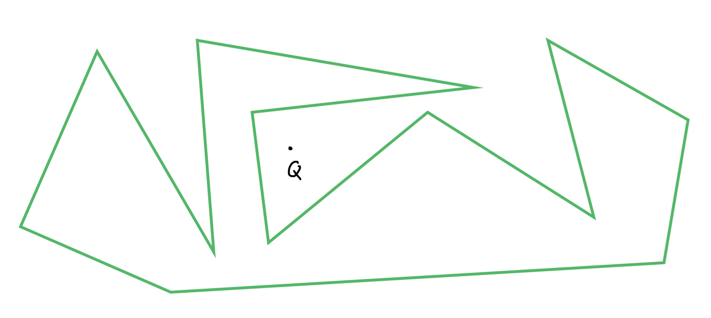
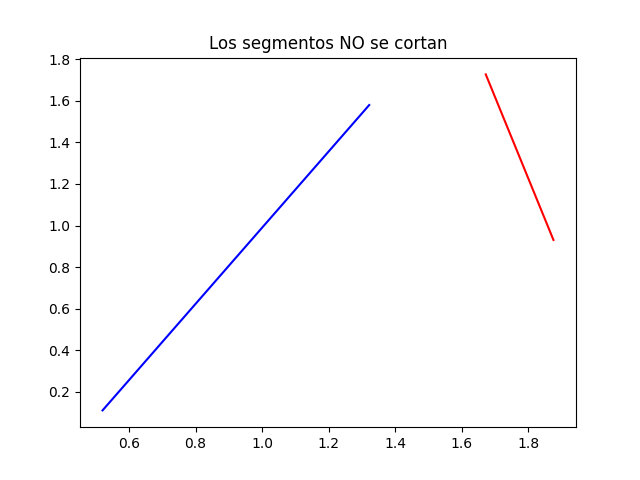
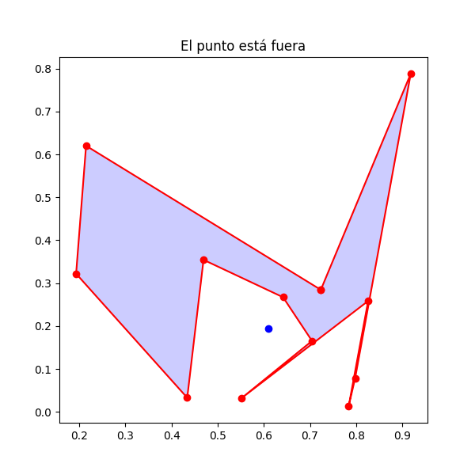
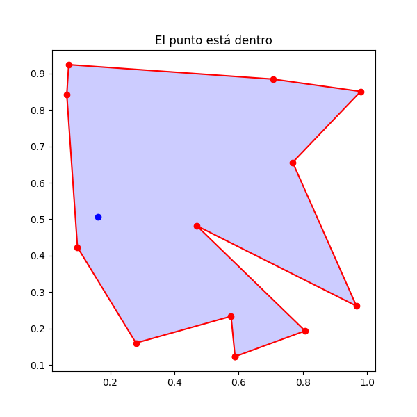

# Point inside a polygon
Santiago Lillo Macías
2026-04-16

This second file consists in determining wether or not a point is inside a polygon. We import the `Punto` (point) class used on the previous folder, and the other basic functions.

To determine if a point is inside a polygon we use the following result: a point is inside a polygon when drawing an infinite line, call it r, to any direction on the plane, r intersects odd times with the polygon edges.

Computationally we can't draw an infinite line, of course, but we can draw a line big "enough". We will see this later on the code. 

A usual situation is the following:



# Segments intersection

Knowing when two segments intersect is fundamental for the code. But when do segments intersect?

Let A,B,C,D be four points on the plane. Let AB and CD be two segments. If
-A and B are on different sides of the segment CD
-C and D are on different sides of the segment AB
then AB and CD intersect. 

Then we can construct the function.
Input: s, t as a `Punto` list, vertices of s and t.
Output: True/False if s y t intersect (also True if they intersect on a vertex or they are the same segment)

```{python}
def segmentos_se_cortan(s: list[Punto], t: list[Punto]) -> bool:
    a,b = s[0],s[1]
    c,d = t[0],t[1]
    return (izquierda(a,b,c) != izquierda(a,b,d)) and (izquierda(c,d,a) != izquierda(c,d,b))
```

# Point and polygon

We are given a `Punto` list. In that order, the list is sorted as if we iterate through the polygon. `q` is the point to determine. The function returns `True` if `q` is inside `pol`. 

An interesting detail is how to construct the segment from `q` so that it is "big-enough". We take the max of all the x and y points coordinates, and we duplicate it (you can just add one, or whatever you want).

We evaluate the intersection function with the big segment and every other segment. If the number of intersections is odd, then it is inside.

```{python}
def punto_en_poligono(q: Punto, pol: list[Punto]) -> bool:
    coordenadas_x = [p.x for p in pol]
    coordenadas_y = [p.y for p in pol]
    punto_rayo = Punto(2*max(coordenadas_x), 2*max(coordenadas_y))
    segmento = [q,punto_rayo]
    contador_cortes = 0
    
    for i in range(len(pol)):
        # Definimos el lado del polígono
        lado = [pol[i], pol[(i + 1) % len(pol)]]
        
        if segmentos_se_cortan(segmento, lado):
            contador_cortes += 1

    if contador_cortes % 2 == 1:
        return True
    else:
        return False
```

# Test functions

Ignore

```{python}
def comprueba_segmentos_se_cortan(s = None, t = None, size = 2, entero = False):
    def punto_aleatorio():
        if entero:
            return Punto(random.randint(0, size), random.randint(0, size))
        else:
            return Punto(random.uniform(0, size), random.uniform(0, size))
    if s is None:
        s = [punto_aleatorio(), punto_aleatorio()]
    if t is None:
        t = [punto_aleatorio(), punto_aleatorio()]
    respuesta = segmentos_se_cortan(s, t)
    plt.plot([p.x for p in s], [p.y for p in s], 'blue')
    plt.plot([p.x for p in t], [p.y for p in t], 'red')
    texto = 'Sí se cortan' if respuesta else 'NO se cortan'
    texto = 'Los segmentos ' + texto
    plt.title(texto)
    plt.show()
    return

def comprueba_punto_en_poligono(q = None, pol = None, n_vertices = 12):
    def intersects(p1, p2, p3, p4):
        """Check if line segment (p1,p2) intersects with (p3,p4)."""
        def ccw(A, B, C):
            return (C[1]-A[1]) * (B[0]-A[0]) > (B[1]-A[1]) * (C[0]-A[0])
        
        # Standard line intersection formula
        return ccw(p1, p3, p4) != ccw(p2, p3, p4) and ccw(p1, p2, p3) != ccw(p1, p2, p4)

    def generate_random_polygon(n):
        # 1. Create random points
        points = np.random.rand(n, 2)
        
        # 2. The "Untangling" loop
        swapped = True
        while swapped:
            swapped = False
            for i in range(n):
                for j in range(i + 2, n):
                    # Don't check adjacent edges (they share a vertex)
                    if i == 0 and j == n - 1: continue
                    
                    # Define the four points of the two edges we are checking
                    p1, p2 = points[i], points[(i + 1) % n]
                    p3, p4 = points[j], points[(j + 1) % n]
                    
                    if intersects(p1, p2, p3, p4):
                        # 3. Swap the order of points between i+1 and j to uncross
                        points[i+1:j+1] = points[i+1:j+1][::-1]
                        swapped = True
        return points

    # --- Plotting ---
    if pol is None:
        poly_points = generate_random_polygon(n_vertices)
    else:
        poly_points = np.array([[p.x, p.y] for p in pol])
    # Close the polygon for plotting
    plot_data = np.vstack([poly_points, poly_points[0]])

    plt.figure(figsize=(6,6))
    plt.plot(plot_data[:,0], plot_data[:,1], 'ro-')
    plt.fill(plot_data[:,0], plot_data[:,1], alpha=0.2, color='blue')
    
    if q is None: q = Punto(random.uniform(0,1), random.uniform(0,1))
    plt.plot(q.x, q.y, 'bo')
    pol = [Punto(*row) for row in poly_points]
    respuesta = punto_en_poligono(q, pol)
    texto = 'dentro' if respuesta else 'fuera'
    texto = 'El punto está ' + texto
    plt.title(texto)
    plt.show()
```

# Examples

```{text}
comprueba_segmentos_se_cortan()
```



```{text}
comprueba_segmentos_se_cortan()
```


```{text}
comprueba_punto_en_poligono()
```



```{text}
comprueba_punto_en_poligono()
```


