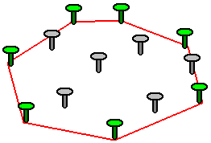
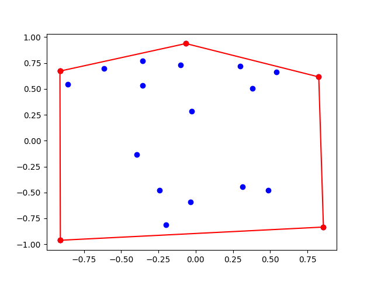
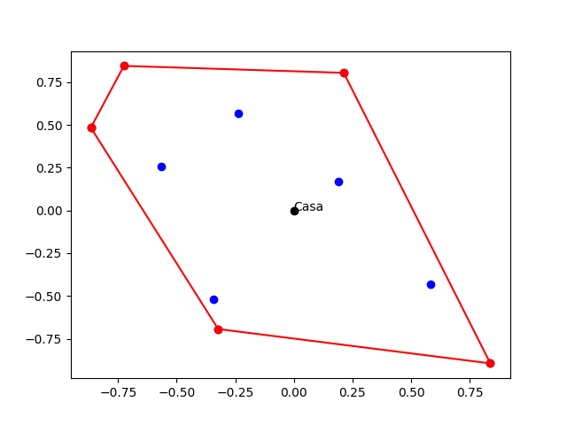

# Convex hull. A short introduction.

Santiago Lillo Macías
2026-04-22

Imagine you have a fenced-in lot with several trees. How to distribute the fence so that every tree is included? Trees can (in fact they must) be on the fence.



The red line is called _convex hull_. Point out that some trees are part of the convex hull, and others are inside.

Scale up to points on the plane.



If you want to design the algorithm for the convex hull, skip to the next project. For now, we treat the convex hull as a black box (we now the rsult, but not the process) and play with it.

# Trees lot

Pepita lives on the $(0,0)$ `Punto`. She has a polygonal convex lot, full of trees. She already has built the convex hull (black box), but she wants to install some sensors in the trees of the border. Then she comes back home. She walks at a 1 $m/s$ pace, and takes 2 seconds to install the sensors at each tree. Determine the minimum time for Pepita to do this very complex task. Help Pepita!

-Input: list of `Punto` objects.

-Output: time (int)

```{python}
def distancia(P:Punto, Q:Punto) -> float:
    return math.sqrt((Q.x-P.x)**2 + (Q.y-P.y)**2)

def rodea_la_finca(puntos):
    casa = Punto(0,0)

    # Look for the nearest tree
    distancias = [distancia(casa,puntos[i]) for i in range(len(puntos))]
    start_dist = distancias[0]
    indice = 0
    for i in range(len(distancias)):
        if distancias[i] < start_dist:
            start_dist = distancias[i]
            indice = i
    start_point = puntos[indice]

    # Build the segments Pepita goes through. 
    recorrido = [casa, start_point] + puntos[indice:] + puntos[:indice] + [casa]
    distance = 0
    # Sum the distances between trees
    for i in range(len(recorrido)-1):
        distance += distancia(recorrido[i],recorrido[i+1])

    # Sum 1 second for each tree (remember Pepita taes 2 seconds to install the sensors)
    return distance + len(puntos)
```

# Fallen tree

Imagine a tornado has destroyed the fence, poor Pepita! :( . One of the trees is fallen, but Pepita does not know which of them it is. Determine an upper bound to build a new fence.

-Input: list of `Punto` objects, every tree, including the possibly fallen one.

-Output: upper bound (meters), float. 

Idea: remove the first tree, then replace it and remove the second tree, ... and so on. Compare the perimeters.

```{python}
def perimetro(puntos):
    distance = 0
    for i in range(len(puntos)):
        distance += distancia(puntos[i],puntos[(i+1)%len(puntos)])
    return distance

def arbol_caido(puntos):

    puntos_aux = puntos[:]
    del puntos_aux[0]
    cota_superior = perimetro(envolvente_convexa_IA(puntos_aux))

    # comprobamos borrando cada posible árbol del borde
    for i in range(1, len(puntos)):
        puntos_aux = puntos[:]        # copia fresca en cada iteración
        del puntos_aux[i]
        val = perimetro(envolvente_convexa_IA(puntos_aux))
        if val > cota_superior:
            cota_superior = val

    return cota_superior
```


