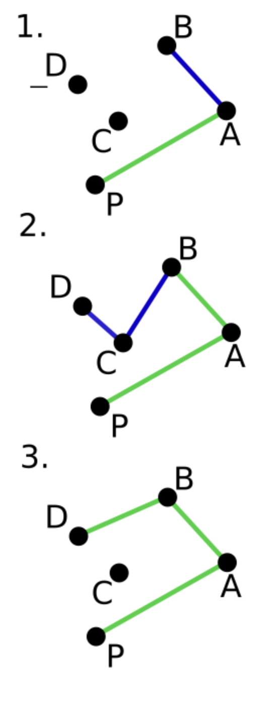
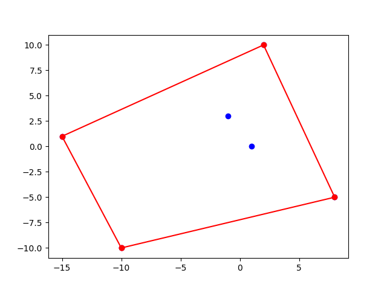
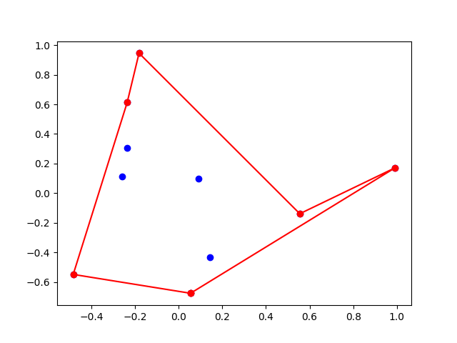
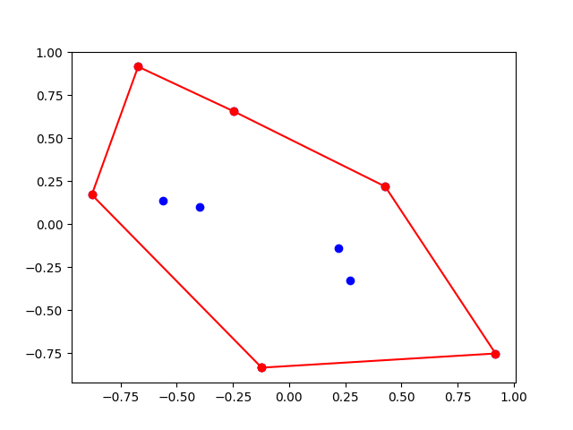
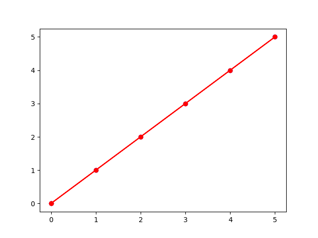
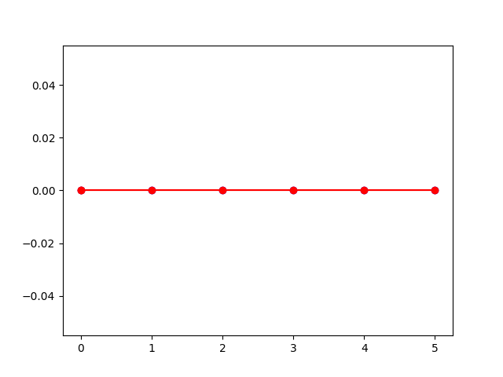
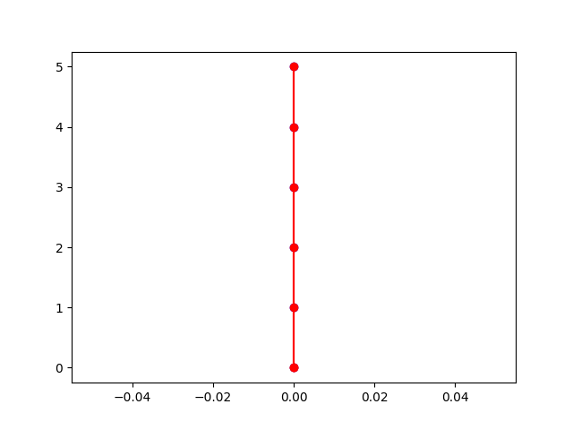
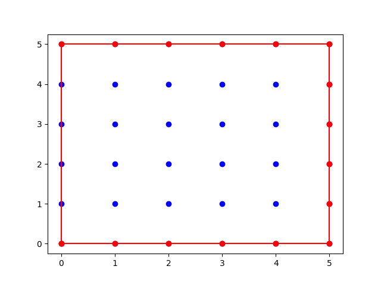
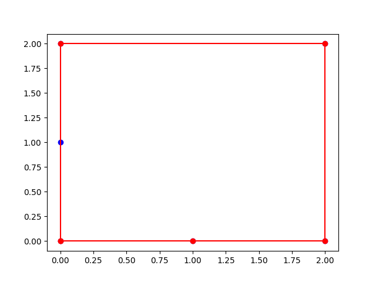
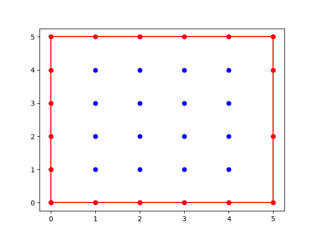

# Convex hull. Graham scan algorithm.

Santiago Lillo Macías
2026-04-22

This algorithm is called "Graham Scan". It determines the convex hull of a set of points. There are other algorithms such as Jarvis March, incremental, ...

Algorithm:

1) Determine the lowest (y-coordinate) point. Call this $P_0$.

2) Sort points with their angle from $P_0$. Label them as $P_1$, $P_2$, ...

3) Add $P_0$ and $P_1$ to the convex hull. Iterate the points. Imagine you are in $P_i$. If you turn left to $P_{i+1}$, add $P_{i+1}$ to the convex hull. If you turn right, remove $P_i$ and add $P_{i+1}$.



The following is an explanation of my code in spanish. I remarked the errors I encountered while writing the code.

#############################################

Primero vamos a tomar el punto más alejado (más bajo, y en caso de empate, más a la izquierda), pero me dio un error 

```text
    ordenados = sorted(puntos, key=lambda p: (p.y, p.x)) #sorted ordena de menor a mayor
                                              ~^^^
TypeError: 'Punto' object is not subscriptable
```
Así que lo cambié a 

```text
    ordenados = sorted(puntos, key=lambda p: (p.y, p.x)) #sorted ordena de menor a mayor
````

Como se puede ver en el siguiente ejemplo

```text
[Running] python -u "/Users/salillo/Desktop/Universidad/Universidad 4º/Segundo Cuatrimestre/GECOM/Prácticas/LilloMacias_p5.py"
Puntos sin ordenar:  [(0.7224993247748563,-0.7153090929536738), (0.7080974043128345,0.796913722608827), (0.6233260811187147,0.48206369743782895), (0.5056366219308039,0.5170580550075767), (0.6813704920882042,0.5444737687403072), (-0.3686341145349623,0.6848350324349011), (-0.8447297670480407,-0.21717844413290588), (-0.25124185033296764,0.39845682776019165), (-0.17210330189785394,-0.1560254035257267), (-0.7629187103810013,0.3124808781522439)]
Puntos ordenados:  [(0.7224993247748563,-0.7153090929536738), (-0.8447297670480407,-0.21717844413290588), (-0.17210330189785394,-0.1560254035257267), (-0.7629187103810013,0.3124808781522439), (-0.25124185033296764,0.39845682776019165), (0.6233260811187147,0.48206369743782895), (0.5056366219308039,0.5170580550075767), (0.6813704920882042,0.5444737687403072), (-0.3686341145349623,0.6848350324349011), (0.7080974043128345,0.796913722608827)]
```

Testamos lo que llevamos hasta ahora

```{python}
def envolvente_convexa(puntos):
    # Input: lista de puntos
    # Output: lista ordenada positivamente de los puntos que componen la envolvente" convexa

    print('puntos: ', puntos)
    
    #1.- Tomamos el punto más bajo. Desempate: el de más a la izquierda
    ordenados = sorted(puntos, key=lambda p: (p.y, p.x)) #sorted ordena de menor a mayor
    punto_inicial = ordenados[0]

    print('ordenados por coordenada y: ', ordenados)

    #2.- Calculamos sus "ángulos relativos". 
    nuevos_puntos = []
    for punto in ordenados[1:]: #Quitamos el punto_inicial
        nuevos_puntos.append([punto, math.atan2(punto.y - punto_inicial.y, punto.x - punto_inicial.x)])

    print('puntos con arcotangente: ', nuevos_puntos)

    #3.- Ordenamos la nueva lista de menor a mayor según su ángulo respecto de punto_inicial 
    # La arcotangente está en la posición [1] de la nueva tupla que hemos añadido
    #En caso de igual ángulo, tomamos primero el más bajo. No puede haber dos puntos distintos con igual ángulo e igual altura.
    nuevos_ordenados = sorted(nuevos_puntos, key=lambda p: (p[1], p[0].y)) 

    print('puntos ordenados según su arcotangente: ', nuevos_ordenados)

    #4.- Nos olvidamos de las arcotangentes y nos quedamos solo con los puntos.

    lista_puntos = [nuevos_ordenados[i][0] for i in range(len(nuevos_ordenados))]

    print('lista_puntos: ', lista_puntos)

    lista_puntos = [punto_inicial] + lista_puntos 

    print('lista_puntos: ', lista_puntos)

    return 0
```

para un caso particular. Lo ploteamos con ayuda de la IA:

```{python}
import matplotlib.pyplot as plt
puntos = [(2,10),(-1,3),(-10,-10),(8,-5),(-15,1), (1,0)]

# 1. Separar coordenadas X e Y
xs, ys = zip(*puntos)

# 2. Crear la figura
plt.figure(figsize=(8, 6))
plt.scatter(xs, ys, color='red', zorder=5)

# 3. Añadir ejes cartesianos que crucen por el origen (opcional, pero estético)
plt.axhline(0, color='black', linewidth=1)
plt.axvline(0, color='black', linewidth=1)

# 4. Iterar para poner las coordenadas sobre cada punto
for x, y in puntos:
    plt.text(x, y + 0.2, f'({x}, {y})', fontsize=9, ha='center')

# 5. Configurar etiquetas y mostrar
plt.xlabel('Eje X')
plt.ylabel('Eje Y')
plt.grid(True, linestyle='--', alpha=0.6)
plt.axis('equal')
plt.show()
```

```text
[Running] python -u "/Users/salillo/Desktop/Universidad/Universidad 4º/Segundo Cuatrimestre/GECOM/Prácticas/LilloMacias_p5.py"
puntos:  [(2,10), (-1,3), (-10,-10), (8,-5), (-15,1), (1,0)]
ordenados por coordenada y:  [(-10,-10), (8,-5), (1,0), (-15,1), (-1,3), (2,10)]
puntos con arcotangente:  [[(8,-5), 0.27094685033842053], [(1,0), 0.7378150601204649], [(-15,1), 1.9974238199217726], [(-1,3), 0.9652516631899266], [(2,10), 1.0303768265243125]]
puntos ordenados según su arcotangente:  [[(8,-5), 0.27094685033842053], [(1,0), 0.7378150601204649], [(-1,3), 0.9652516631899266], [(2,10), 1.0303768265243125], [(-15,1), 1.9974238199217726]]
lista_puntos:  [(8,-5), (1,0), (-1,3), (2,10), (-15,1)]
lista_puntos:  [(-10,-10), (8,-5), (1,0), (-1,3), (2,10), (-15,1)]
0
```

Mi primer intento para el "paso interesante" del Graham Scan fue

```{python}

def envolvente_convexa(puntos):
    
    #.........
    
    #5.- Iteramos sobre los puntos
    #a,b,c son mis variables auxiliares, para no tocar "demasiado" lista_puntos

    i = 0
    a = lista_puntos[0]
    b = lista_puntos[1] #El primer punto respecto de punto_inicial siempre está
    c = lista_puntos[2] #Candidato a estar en la envolvente
    envolvente = [a,b]

    while c != lista_puntos[1]:

        print('a',a,'b',b,'c',c)
        
        if orient(a,b,c) == 1:
            print(f'{c} está a la izquierda de {a}{b}')

        if orient(a,b,c) == -1:
            print(f'{c} está a la derecha de {a}{b}')

        if orient(a,b,c) == 1 or orient(a,b,c) == 0:

            if c not in envolvente:
                envolvente.append(c) 

            print('envolvente1: ',envolvente)

            a = lista_puntos[(i+1)%len(lista_puntos)]
            b = lista_puntos[(i+2)%len(lista_puntos)]
            c = lista_puntos[(i+3)%len(lista_puntos)]
            i = i+1

        else:

            while orient(a,b,c) == -1:

                del(envolvente[-1]) #eliminamos el candidato anterior porque hemos girado a la derecha
                if c not in envolvente:
                    envolvente.append(c) 
                a = a
                b = c #El c antiguo
                c = lista_puntos[(i+3)%len(lista_puntos)]


                print('envolvente2: ',envolvente)

    return envolvente
```

Probemos con nuestro caso anterior

```{text}
puntos = [Punto(2,10),Punto(-1,3),Punto(-10,-10),Punto(8,-5),Punto(-15,1), Punto(1,0)]
comprueba_envolvente_convexa(puntos, None)
```

Parece que funciona bien



Pero si probamos con genera_input



que claramente es incorrecto.

Pensando junto con ayuda de la IA, me doy cuenta de que estoy cambiando el valor de c antes de asegurarme de que gira a la izquierda. Además, es mejor pensar acceder a los puntos anteriores de la envolvente como una pila, envolvente[-1] y envolvente[-2].

Ahora, cambiando el paso 5, tenemos nuestro código correcto

```{python}

def envolvente_convexa(puntos):
    # Input: lista de puntos
    # Output: lista ordenada positivamente de los puntos que componen la envolvente" convexa

    print('puntos: ', puntos)
    
    #1.- Tomamos el punto más bajo. Desempate: el de más a la izquierda
    ordenados = sorted(puntos, key=lambda p: (p.y, p.x)) #sorted ordena de menor a mayor
    punto_inicial = ordenados[0]

    print('ordenados por coordenada y: ', ordenados)

    #2.- Calculamos sus "ángulos relativos". 
    nuevos_puntos = []
    for punto in ordenados[1:]: #Quitamos el punto_inicial
        nuevos_puntos.append([punto, math.atan2(punto.y - punto_inicial.y, punto.x - punto_inicial.x)])

    print('puntos con arcotangente: ', nuevos_puntos)

    #3.- Ordenamos la nueva lista de menor a mayor según su ángulo respecto de punto_inicial 
    # La arcotangente está en la posición [1] de la nueva tupla que hemos añadido
    #En caso de igual ángulo, tomamos primero el más bajo. No puede haber dos puntos distintos con igual ángulo e igual altura.
    nuevos_ordenados = sorted(nuevos_puntos, key=lambda p: (p[1], p[0].y, p[0].x)) 

    print('puntos ordenados según su arcotangente: ', nuevos_ordenados)

    #4.- Nos olvidamos de las arcotangentes y nos quedamos solo con los puntos.

    lista_puntos = [nuevos_ordenados[i][0] for i in range(len(nuevos_ordenados))]

    print('lista_puntos: ', lista_puntos)

    lista_puntos = [punto_inicial] + lista_puntos 

    print('lista_puntos: ', lista_puntos)
    

    #5.- Iteramos sobre los puntos
    
    #El primero y el segundo siempre
    envolvente = [lista_puntos[0],lista_puntos[1]]

    #No consideramos el primero y el segundo (ya están)
    for punto in lista_puntos[2:]:
        
        # Mientras giremos a la derecha, eliminar el último
        while orient(envolvente[-2], envolvente[-1], punto) == -1:
            envolvente.pop()
        
        envolvente.append(punto)

    return envolvente

```

Como ejemplo



Miramos algunos casos extremos

```{text}
puntos = [Punto(0,0),Punto(1,1), Punto(2,2), Punto(3,3), Punto(4,4), Punto(5,5)]
comprueba_envolvente_convexa(puntos, None)
```







Un caso que nos da error es el siguiente:





Vemos que el punto (0,1) no lo añade a la envolvente. 

Lo primero que se me ocurre es que en los casos anteriores de Puntos alineados, los recorre todos en una dirección, mientras que en este caso, queremos que "baje" por el punto (0,1). Pero lista_puntos imprime primero (0,1) y después (0,2). Así que el error está en cómo me ordena los puntos. Si añado a la envolvente el punto (0,1), porque es el siguiente punto después de (2,2), evalúo 

```{text}
orient(Punto(2,2), Punto(0,1), Punto(0,2))
```

que es un giro a la derecha. Por tanto, elimina el Punto(0,1) y añade el Punto(0,2). Lo mismo sucede con una cantidad de puntos mayor alineados en el eje y.

Por ello, habrá que invertir los últimos puntos de la secuencia. ¿Y cuáles son los últimos?: Aquellos que tienen el mismo ángulo relativo.

```{python}
def envolvente_convexa(puntos):
    # Input: lista de puntos
    # Output: lista ordenada positivamente de los puntos que componen la envolvente" convexa
    
    #1.- Tomamos el punto más bajo. Desempate: el de más a la izquierda
    ordenados = sorted(puntos, key=lambda p: (p.y, p.x)) #sorted ordena de menor a mayor
    punto_inicial = ordenados[0]

    #2.- Calculamos sus "ángulos relativos", y los ordenamos angularmente.
    nuevos_puntos = []
    for punto in ordenados[1:]: #Quitamos el punto_inicial
        nuevos_puntos.append([punto, math.atan2(punto.y - punto_inicial.y, punto.x - punto_inicial.x)])
    #Ordenar por ángulo, y para ángulos iguales por distancia decreciente (más lejano primero)
    nuevos_ordenados = sorted(nuevos_puntos, key=lambda p: (p[1], p[0].y, distancia(punto_inicial, p[0]))) 

    #---------------------------------------------------------------------- (*)

    lista_alineados_finales = nuevos_ordenados[::-1] #invertimos la lista
    indice = 0
    for punto in lista_alineados_finales:
        if punto[1] == lista_alineados_finales[0][1]:
            indice += 1
    indice -= 1

    #Los 'indice' últimos elementos de la lista nuevos_ordenados tienen la misma arcotangente. Invertimos ese orden
    elementos_con_la_misma_atan = lista_alineados_finales[:indice+1]
    print('elementos con la misma atan', elementos_con_la_misma_atan)

    for i in range(indice):
        nuevos_ordenados.pop()

    nuevos_ordenados = nuevos_ordenados + elementos_con_la_misma_atan

    #---------------------------------------------------------------------- (*)

    #3.- Nos olvidamos de las arcotangentes y nos quedamos solo con los puntos. Le añadimos el punto inicial.
    lista_puntos = [nuevos_ordenados[i][0] for i in range(len(nuevos_ordenados))]
    lista_puntos = [punto_inicial] + lista_puntos 

    print(lista_puntos)

    #4.- Iteramos sobre los puntos
    #El primero y el segundo siempre están
    envolvente = [lista_puntos[0],lista_puntos[1]]
    ultimo_lado = [envolvente[-2],envolvente[-1]]

    for punto in lista_puntos[2:]:
        ultimo_lado = [envolvente[-2],envolvente[-1]]
        # Mientras giremos a la derecha, eliminar el último
        while orient(ultimo_lado[0], ultimo_lado[1], punto) == -1:
            envolvente.pop()
            ultimo_lado = [envolvente[-2],envolvente[-1]]
        envolvente.append(punto)

    return envolvente
```

La solución para lo spuntos alineados es la siguiente:

```{text}
Nuestro criterio de desempate es la distancia al punto inicial. Pero esto nos crea un problema. En la "última" (posible) secuencia de puntos alineados, 
nuestro criterio los ordena en orden ascendente, pero al recorrer la envolvente en sentido antihorario, queremos que los recorra en orden descendente.
Por ello, lo que hacemos es lo siguiente:
1.- Invertimos la lista.
2.- Buscamos cuáes son los elementos con el mismo ángulo relativo.
3.- Nos guardamos un índice, que es el número de elementos con el mismo ángulo.
4.- Quitamos (por el final) el mismo número de elementos que 'índice'.
5.- Los volvemos añadir, pero esta vez, invertidos. Es decir, en orden "desdencente".
Por tanto, lo que tenemos es casi la misma lista que la inicial, pero con os últimos puntos invertidos de orden.
Hemos añadido funciones de orden lineal, así que no afecta a nuestra complejidad
```

Ahora nuestro algoritmo Graham Scan calcula correctamente la envolvente en los casos límite

