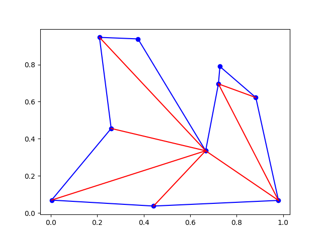
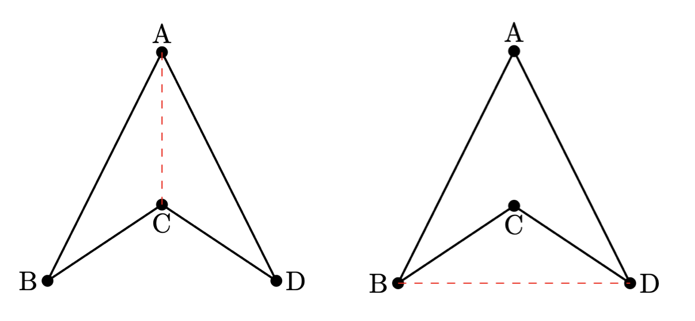
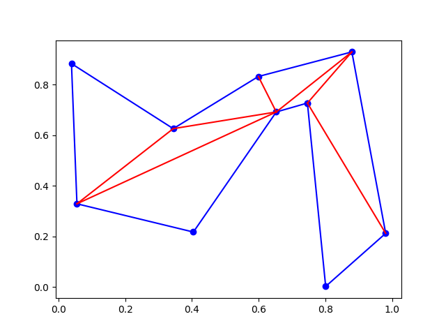

# Polygon triangulation

Santiago Lillo Macías
2026-04-29

We approach this problem: determine a triangulation of a given polygon. Note that I said __a__ triangulation, and not __the__ triangulation. There could exist many triangulations for a given polygon. In this project we implement the ear clipping algorithm. 



# Basic concepts

## Internal diagonal

It is a list of points $[p,q]$ so that the segment lives inside the polygon. In the example, $A-C$ is an internal diagonal, while $B-D$ is not.



## Convex vertex

It is a vertex that has a convex angle. When iterating through the points you "turn left" when you get to this vertex. In the example $A,B,D$ are convex vertex. $C$ is not. 

## Ear

It is a triangle $v_{i-1},v_i,v_{i+1}$ where

1) $v_i$ is a convex vertex

2) No other point is inside the triangle $v_{i-1},v_i,v_{i+1}$.

It is know than every polygon ($n \geq 4$) has at least two ears. Note that if you cut an ear, the new polygon has -again- two ears. 

# Algorithm

The algorithm consists of "cutting the ears", called _ear clipping_.

-Input: polygon (list of points)

-Output: list of the internal diagonals

```{text}
Let n be the number of vertices
Diagonals = []
If n <= 3 return []
while n >= 3:
    find an ear of vertex v_i
    add [v_{i-1},v_{i+1}] to Diagonals
    delete v_i from the polygon input
    n <- n-1
return Diagonals
```

But finding the ears is not that easy

## Ear finding

First we'll have to check if the vertex is convex.

-Input: polygon vertex and polygon point list (positively oriented)

-Output: Yes/No

```{python}
def es_vertice_convexo(v:Punto, pol: list[Punto]) -> bool:
    i = pol.index(v) # posición del vértice en la lista
    n = len(pol)
    # Vértice convexo <--> v_i Gira a la izquierda <--> v_{i+1} a la izquierda de [v_{i-1},v_i] <--> orient(v_{i-1},v_i,v_{i+1}) = 1 ó 0
    if orient(pol[(i-1)%n], pol[i], pol[(i+1)%n]) == 1 or orient(pol[(i-1)%n], pol[i], pol[(i+1)%n]) == 0:
        return True
    else:
        return False
```

And, if the vertex $v_i$ is convex, we can check the second condition: to not have any point inside.

-Input: vertex index ($i$) and polygon

-Output: Yes/No

```{python}
def es_diagonal_interna(i: int, pol: list[Punto]) -> bool:
    n = len(pol)
    p = pol[(i-1)%n]
    v = pol[i]
    q = pol[(i+1)%n]
    triangulo = [p, v, q]

    if es_vertice_convexo(pol[i], pol):
        for j in range(n):
            if j!=(i-1)%n and j!=i and j!=(i+1)%n and punto_en_triangulo(pol[j], triangulo):
                return False # Viola la condición 
        return True # Cumple a) porque ha entrado en el if
                    # Cumple b) porque ha entrado y salido del bucle for sin que haya ningún vértice extra dentro del triángulo (no ha devuelto False)
    else:
        return False # Viola la condición a)
```

Finally we can search ears in the polygon

-Input: polygon

-Output: ear, the first the algorithm finds

```{python}
def encuentra_oreja(pol:list[Punto])->Punto:
    n = len(pol)
    for i in range(n):
        if es_diagonal_interna(i,pol):
            return pol[i] # Devuelve el primero que encuenta
```

# Code

- Input: polygon
- Output: list of diagonals

```{python}
def triangula_poligono(pol:list[Punto]):
    diagonales = []
    n = len(pol)
    if len(pol) == 3:
        return diagonales
    while n > 3:
        v_i = encuentra_oreja(pol)
        i   = pol.index(v_i)
        diagonales.append([pol[(i-1)%n],pol[(i+1)%n]])
        pol.remove(v_i)
        n = n-1
    return diagonales
```

# Test functions

We use these auxiliary functions 

```{python}
def generate_random_polygon(n):
    # 1. Create random points
    points = [Punto(random.uniform(0,1), random.uniform(0,1)) for _ in range(n)]
    
    # 2. The "Untangling" loop
    swapped = True
    while swapped:
        swapped = False
        for i in range(n):
            for j in range(i + 2, n):
                # Don't check adjacent edges (they share a vertex)
                if i == 0 and j == n - 1: continue
                
                # Define the four points of the two edges we are checking
                p1, p2 = points[i], points[(i + 1) % n]
                p3, p4 = points[j], points[(j + 1) % n]
                
                if segmentos_se_cortan([p1, p2], [p3, p4]):
                    # 3. Swap the order of points between i+1 and j to uncross
                    points[i+1:j+1] = points[i+1:j+1][::-1]
                    swapped = True
    
    area = 0
    for i in range(n):
        area += prod_vect(points[i], points[(i + 1) % n])
    if area < 0: return points[::-1]
    else: return points
    
def comprueba_triangulacion(pol = None):
    if pol is None: pol = generate_random_polygon(10)
    
    diagonales = triangula_poligono(pol.copy())  
    
    #dibuja el polígono (vértices en verde, lados en azul) y las diagonales (en rojo)
    pol.append(pol[0])
    plt.plot([p.x for p in pol], [p.y for p in pol], 'bo-')
    for s in diagonales:
        plt.plot([p.x for p in s], [p.y for p in s], color = 'red')
    plt.show() 
```

# Examples

```{text}
pol = None
comprueba_triangulacion(pol)
```



Sometimes this algorithm does not provide the _best_ or the _nicest_ triangulation. Next figure shows a not so nice one.


Other algorithms such as Delunay triangulation have this _nicer_ approach. You have it on folder 8.