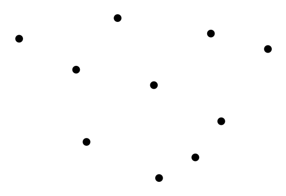
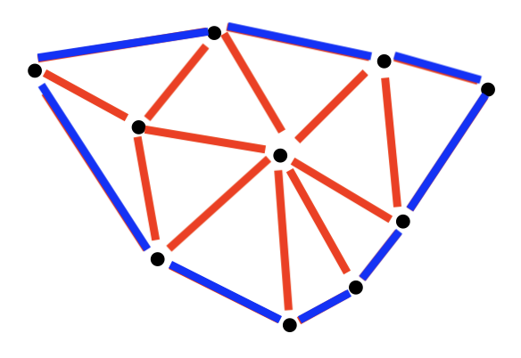
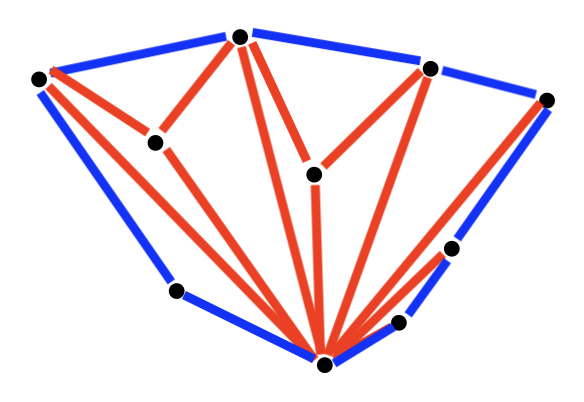
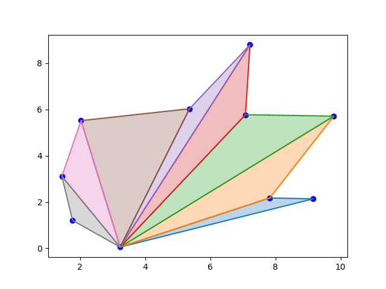
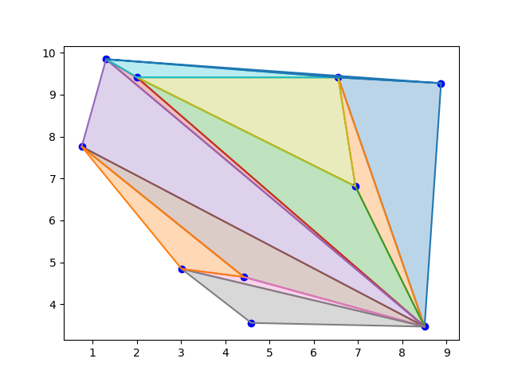
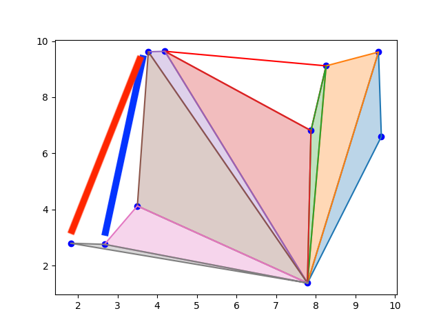
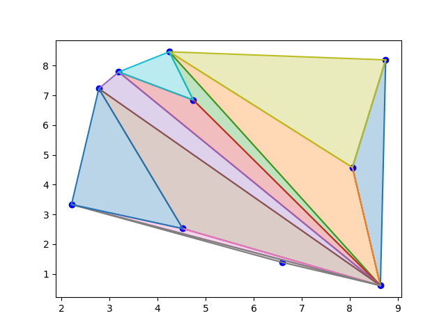

# Cloud triangulation

Santiago Lillo Macías
2026-05-02

In the last project we wanted to triangulate a polygon. It was given as a list of `Punto` objects, with an specific order. Now we want to triangulate a cloud of points. We are given a set of points with no specific order, such as the following.



This could be triangulated in many different ways.





These are two valid triangulation. Remark both convex hull are the same.

In this project we'll implement an algorithm more like the second one. The other one (nicer) will be implemented in the next file.

We will reuse our Graham Scan algorithm -some ideas and concepts. If you are not familiar with it, please refer to folder 5. 

## Algorithm idea

1. Choose a Pivot point. The "farthest" one.
2. Draw a line from it to every other point.
3. Complete the triangles with the Graham Scan algorithm.

Next picture shows the algorithm state between step 2 and 3



Next picture shows a terminated algorithm (different point cloud).



# Function

- Input: `Punto` list.
- Output: list of triangles (triangle = `Punto` list)

```{python}
def triangula_nube(puntos):
    triangulos = []
    lista_puntos = puntos
    pivote = min(puntos, key=lambda p: (p.y, p.x))
    puntos_restantes = [punto for punto in lista_puntos if punto != pivote] #quito el pivote

    def angulo_pivote(p:Punto):
        return math.atan2(p.y - pivote.y, p.x - pivote.x), math.sqrt((p.y - pivote.y)**2 + (p.x - pivote.x)**2)
    
    puntos_restantes_ordenados = sorted(puntos_restantes, key = angulo_pivote)
    n = len(puntos_restantes_ordenados) #la lista original tiene n+1 puntos

    for i in range(n-1):
        triangulos.append([pivote, puntos_restantes_ordenados[i], puntos_restantes_ordenados[i+1]])

    return triangulos
```

This function halts before entering stage 3.

If we want to complete the triangulation, we have to re-implement Graham's stack idea: while "turning right", save the triangle, and get the next possible triangle. In the following picture, step 3 of the algorithm drwas first the blue line, and then the red one.



The algorithm fully implemented is:

```{python}
def triangula_nube(puntos):
    triangulos = []
    lista_puntos = puntos
    pivote = min(puntos, key=lambda p: (p.y, p.x))
    puntos_restantes = [punto for punto in lista_puntos if punto != pivote] #quito el pivote

    def angulo_pivote(p:Punto):
        return math.atan2(p.y - pivote.y, p.x - pivote.x), math.sqrt((p.y - pivote.y)**2 + (p.x - pivote.x)**2)
    
    puntos_restantes_ordenados = sorted(puntos_restantes, key = angulo_pivote)
    n = len(puntos_restantes_ordenados) #la lista original tiene n+1 puntos

    for i in range(n-1):
        triangulos.append([pivote, puntos_restantes_ordenados[i], puntos_restantes_ordenados[i+1]])

    # Hasta aquí tenemos todos los triángulos desde el pivote (el abanico)
    puntos = [pivote] + puntos_restantes_ordenados
    
    envolvente = [puntos[0], puntos[1]]
    for i in range(2,len(puntos)):
        while len(envolvente) > 0 and orient(envolvente[-2], envolvente[-1], puntos[i]) == -1: #len(envolvente) > 0 para salir del bucle cuando se vacíe 
            triangulos.append([envolvente[-2], envolvente[-1], puntos[i]])
            envolvente.pop()
        envolvente.append(puntos[i])

    return triangulos
```

The `while` loop is extremely important. Without it, in the previous example, the algorithm only would have drawn the blue line. It is a while, because we don't know how many points does the concavity has.

On the `.py` file you have the test function to show thing like this:


