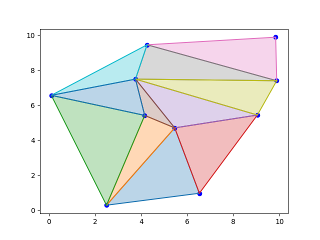
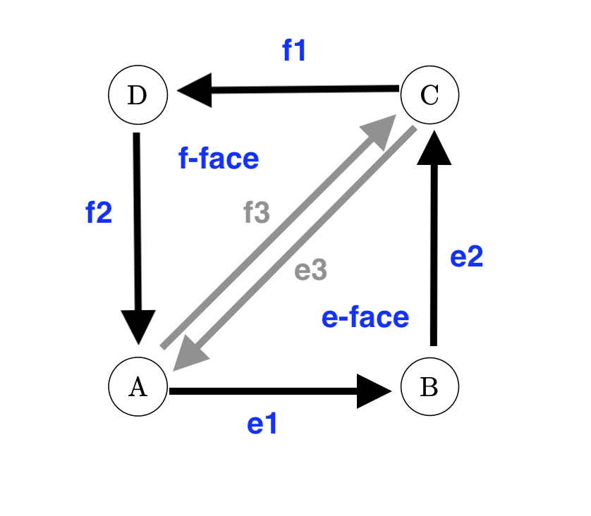
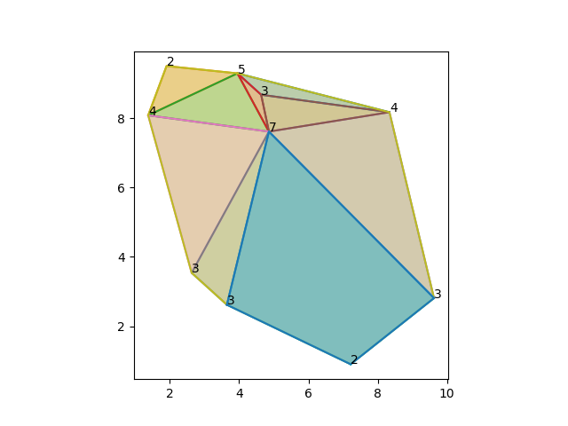
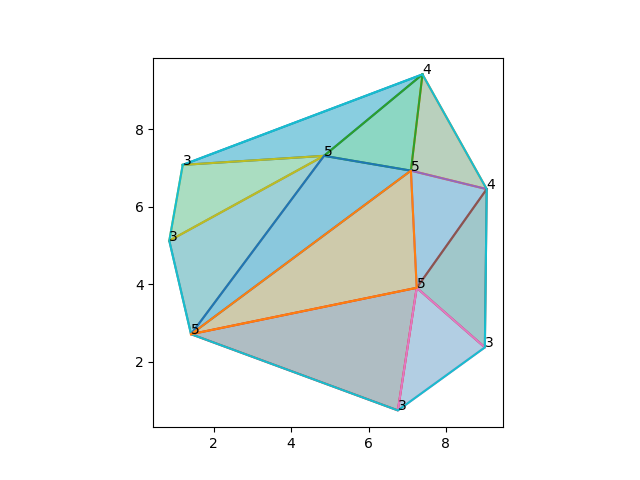

# DCEL

Santiago Lillo Macías
2026-04-24

# Definition

Remember we are working with points triangulation.



But we have several ways to return the triangulation output: the function could return the edges of the triangles, the points of each triangle,... But in all of that cases we don't know much information about the original input, and about the triangles configuration.

That's why we use _DCEL_. _DCEL_ stands for _Doubly Connected Edge List_, and it's a very useful data structure for this particular case. 

-Vertices are `Punto` points on $\mathbb{R}^2$.

-Every edge is directed. For each edge, we store the start and end point. Also the previous, next, and twin edge. And finally, the face to which it belongs to. An edge can't belong to two faces because edges are directed.

-For each face, we store an edge that lives on that face. 

Now, the _DCEL_ is a Data Structure that stores a list of vertices, a list of edges, and a list of faces.

Consider the following image



Take $e_1$. The origin is $A$ and the endpoint is $B$. The next edge is $e_2$. The previous edge is $e_3$. Also, $e_3$ and $f_3$ are twin edges.

# Implementation

I present the _DCEL_ implementation here. This is a first approach, and the full implementation is on the .py file. 

```{python}
class Punto:
    def __init__(self, x, y):
        self.x = x
        self.y = y

class Arista:
    def __init__(self, origen, final, anterior = None, siguiente = None, gemela = None, cara = None):
        self.origen, self.final = origen, final
        self.anterior = anterior
        self.siguiente = siguiente
        self.gemela = gemela
        self.cara = cara           

class Cara:
    def __init__(self, arista_incidente = None):
        self.arista_incidente = arista_incidente

class DCEL:
    def __init__(self, vertices = None):
        self.lista_aristas = {}
        self.lista_caras = []   
        self.lista_vertices = {} # diccionario con los vértices como llaves y una arista incidente como valor 
        self.cara_exterior = None # puntero a la cara exterior, si la hubiera
```

# Example

Consider again the previous photo. Take $f_3$. Then:

```{text}
f3.origen     = A
f3.final      = C

f3.anterior   = f2
f3.siguiente  = f1
f3.gemela     = e3

f3.cara       = f_face
f_cara.arista = f3     #this can also be f1 and f2
```

# Missing edge

Imagine for a moment a little demon 👹 comes to the earth and steals one of our edges (inside the convex hull, not a boundary edge). Then, all the trinagles will be ok, except one region. There will be a quadrilateral somewhere in the cloud. How can you fix this? _DCEL_ is very useful for managing edges and faces atributes. But modifying a simple thing, such as stealing an edge, shuffles everything, and that concrete part -in our case, the quadrilateral- becomes messy. Because then the _next_ edge is not the _next_ we want, and so on.



# Algorithm

-Input: bad triangulation DCEL 👎 ☹️

-Output: fixed triangulation DCEL 👍 😀

## Step 1

Find the bad face:

1) Get the list of faces

2) Iterate through it

3) Find the one who has 4 vertices. That's the one.

## Step 2

Define auxiliary variables. This is more important than it seems. If you constantly use `a.siguiente.anterior`... some variables could become unaccesible or empty.

## Step 3 and 4

Build the new edges. Then define its next, previous,... Same with faces.

## Step 5

Delete the _bad_ face. Then add the new edges and face to the _DCEL_.

```{python}
def arregla(triangulacion: DCEL) -> DCEL:
    #1 Buscamos la cara con 4 lados
    for cara in triangulacion.lista_caras:
        if len(cara.lista_lados()) == 4:
             cara_mala = cara
             break
    indice_cara_mala = triangulacion.lista_caras.index(cara_mala)
        
    #2 Definimos variables auxiliares
    # Muy importante. Nunca "reorganizar" punteros.
    a  = cara_mala.arista_incidente
    v1 = a.origen
    v2 = a.final
    v3 = a.siguiente.final
    v4 = a.anterior.origen

    b = a.siguiente
    c = a.siguiente.siguiente
    d = a.anterior

    #3 Creamos la arista y sus atributos. Modificamos los atributos de las aristas.
    e = Arista(v3,v1)
    e.anterior  = b
    e.siguiente = a

    a.anterior  = e #a.siguiente es el mismo
    b.siguiente = e #b.anterior es el mismo

    # Creamos la gemela y sus atributos. Modificamos los atributos de las aristas.
    f = Arista(v1,v3)
    e.gemela    = f
    f.anterior  = d
    f.siguiente = c
    
    f.gemela    = e
    c.anterior  = f
    d.siguiente = f

    #4 Creamos las caras y sus atributos. Modificamos los atributos
    cara_e = Cara(a)
    cara_f = Cara(c)

    e.cara = cara_e # lo actualizamos para los 3
    a.cara = cara_e
    b.cara = cara_e

    f.cara = cara_f
    c.cara = cara_f
    d.cara = cara_f

    #5 Modificamos la DCEL
    triangulacion.lista_aristas[e] = e
    triangulacion.lista_aristas[f] = f
    del(triangulacion.lista_caras[indice_cara_mala])
    triangulacion.lista_caras.extend([cara_e, cara_f])

    return triangulacion
```

# Test

Now we can test our function

```{python}
def genera_nube_puntos(n, entero = False):
    size = 10    
    if entero: puntos = [Punto(random.randint(0, size), random.randint(0, size)) for _ in range(n)]
    else: puntos = [Punto(random.uniform(0, size), random.uniform(0, size)) for _ in range(n)]    
    return list(set(puntos))


def comprueba_triangulacion(puntos):
    
    triangulos = triangulacion_delaunay_bruta(puntos)
    triangulacion = convierte_lista_triangulos_a_DCEL(triangulos)
    estropea(triangulacion)
    arregla(triangulacion)
    
    # Extra: en el diccionario "grado" introduce el valor del grado de cada vértice de la triangulación
    grado = {}
    for p in triangulacion.lista_vertices.keys():
        e_inicial = triangulacion.lista_vertices[p]    
        g = 0
        e = e_inicial
        tope = e.gemela is None        
        while not tope:            
            e = e.gemela.siguiente # giro en sentido negativo
            g += 1
            tope = e.gemela is None
            if e == e_inicial: break              
        if tope: # p está en la envolvente y no se puede girar 360º recorriendo todas las aristas que salen de p
                 # así que nos movemos en sentido positivo desde e hasta encontrar envolvente de nuevo (arista sin gemela)
            g = 1                   
            while e.anterior.gemela is not None:            
                e = e.anterior.gemela # giro en sentido positivo
                g += 1                
            g += 1
        grado[p] = g        
    triangulacion.plot(grado)
    
    return
```

```{text}
puntos = genera_nube_puntos(10, entero = False)
comprueba_triangulacion(puntos)
```

