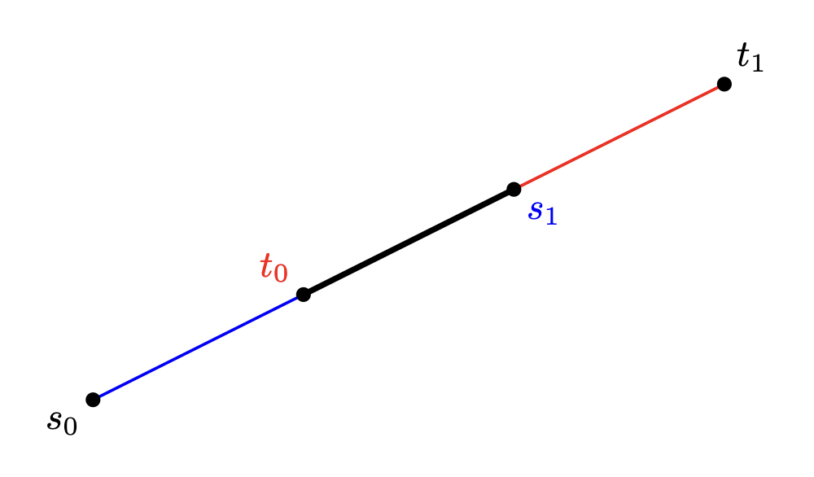
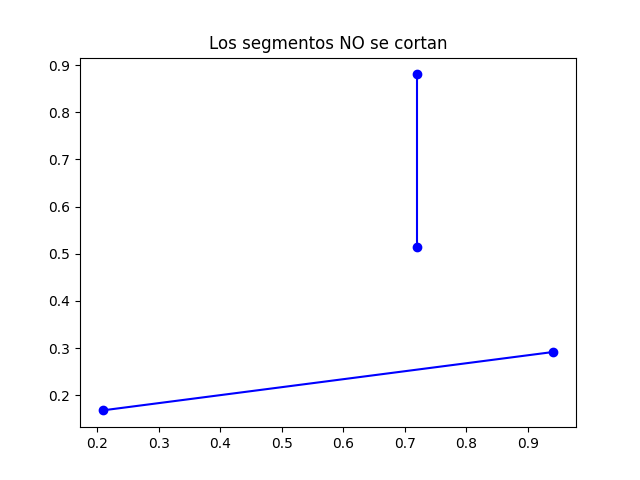
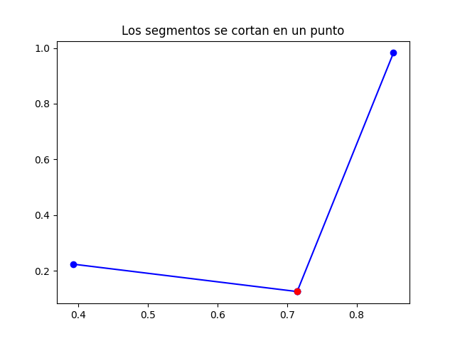
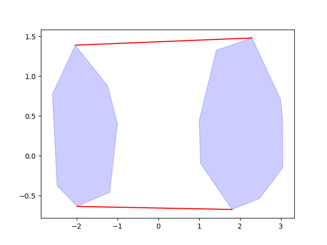

# Functions with polygons 2
Santiago Lillo Macías
2026-04-22

# Segments intersection

Remember we had define the function `segmentos_se_cortan` in the previous project. It told us (Yes/No) if two segments intersect. But now we want to know more about that intersection. Is it a point? Another segment? Is it empty? We consider a segment to be a list of two `Punto` objects.

-Input: two segments.
-Output: None/`Punto`/Segment

We divide into cases:
1) If they don't intersect the result is obvious. Return `None`. 
2) If the two segments are alligned, divide into cases again. This is a tedious job more than a difficult (mathematically speaking) job. I've covered all the cases. **[Figure 1](#figura-1)** shows an example.
3) If the two segments intersect on a point, we construct the lines and solve the linear system of equations with `numpy`. 

<!-- Anclaje para la referencia -->
<a name="figura-1"></a>



```{python}
import numpy as np
```

After importing the library, we can now write the code.

```{python}
def interseca_segmentos(s: list[Punto], t: list[Punto]):

    if not segmentos_se_cortan(s,t):
        return None
    
    else:
        if alineados(s[0],s[1],t[0]) and alineados(s[0],s[1],t[1]): #se cortan en un segmento
            #buscamos cuál es el punto de t (t_0 o t_1) que está dentro de s
            if s[0].x <= t[0].x and t[0].x <= s[1].x:
                if s[1].x <= t[1].x:
                    return [t[0],s[1]]
                if t[1].x <= s[0].x:
                    return [s[0],t[0]]
            if s[0].x <= t[1].x and t[1].x <= s[1].x:
                if t[0].x <= s[0].x:
                    return [s[0],t[1]]
                if s[1].x <= t[0].x:
                    return [t[1],s[1]]
            
        if not (alineados(s[0],s[1],t[0]) and alineados(s[0],s[1],t[1])): #se cortan en un punto
            # y - y_{1} = m(x - x_{1})
            vector_director_s = s[1] - s[0]
            x_1_s = s[0].x
            y_1_s = s[0].y
            m_s = vector_director_s.y / vector_director_s.x
            
            vector_director_t = t[1] - t[0]
            x_1_t = t[0].x
            y_1_t = t[0].y
            m_t = vector_director_t.y / vector_director_t.x
            
            # Sistema:
            #  1x + 6y = 27
            #  7x - 3y = 9

            # Matriz de coeficientes (A)
            A = np.array([[m_s, -1], [m_t, -1]])

            # Vector de términos independientes (B)
            B = np.array([m_s * x_1_s - y_1_s, m_t * x_1_t - y_1_t])

            # Resolver el sistema
            x,y = np.linalg.solve(A, B)
            #punto corte es de tipo 'numpy.float64'
            #El output tiene que estar en formato Punto
            return Punto(x,y)
```

## Testing the function

We can test our function with the following

```{python}
def comprueba_interseccion_segmentos(s = None, t = None):
    alguno_es_None = s is None or t is None
    def punto_aleatorio():        
        return Punto(random.uniform(0, 1), random.uniform(0, 1))
    if s is None:
        s = [punto_aleatorio(), punto_aleatorio()]
    if t is None:
        t = [punto_aleatorio(), punto_aleatorio()]
    if alguno_es_None and random.randint(0,3) == 1: t[0] = s[0]
    def rectifica(seg, n):
        match n % 3:
            case 0: seg[1].x = seg[0].x
            case 1: seg[1].y = seg[0].y
        return seg
    if alguno_es_None: s, t = rectifica(s, random.randint(0,3)), rectifica(t, random.randint(0,3))
    
    respuesta = interseca_segmentos(s, t)
    plt.plot([p.x for p in s], [p.y for p in s], 'bo-')
    plt.plot([p.x for p in t], [p.y for p in t], 'bo-')
    if respuesta is None:
        texto = 'Los segmentos NO se cortan'        
    elif isinstance(respuesta, Punto):
        plt.plot(respuesta.x, respuesta.y, 'ro')
        texto = 'Los segmentos se cortan en un punto'
    else: 
        plt.plot([p.x for p in respuesta], [p.y for p in respuesta], 'red')
        texto = 'Los segmentos se cortan en un segmento'
    plt.title(texto)
    plt.show()
    return
```

Execute some examples

```{text}
comprueba_interseccion_segmentos()
```



```{text}
comprueba_interseccion_segmentos()
```



# External tangents

Given two polygons (list of `Punto`s), determine the two common external tangents.



## Code

-Input: two convex polygons, positive oriented.
-Output: list with four `Punto`s. Two for a tangent line, and two for the other one.

Idea for upper tangent (lower is analogous): start with any two points you want, $[p,q]$. I've selected the first of each list. First, iterate through the polygon 1. If any point $p'$ is at the left of the tangent $[p,q]$, then change it to $[p',q]$. Then do the same for polygon 2. It is highly probable that when you enter the second loop `for` and change a point, the previous point selected from polygon 1 is not the appropriate one. Thus, repeat this until no change has been made.

```{python}
def tangentes_exteriores(pol1: list[Punto], pol2: list[Punto]) -> list[Punto]:
    tangente_arriba = [pol1[0], pol2[0]]
    hemos_cambiado = True
    while hemos_cambiado:
        hemos_cambiado = False
        for punto in pol1:
            if orient(tangente_arriba[0],tangente_arriba[1],punto) == 1:
                tangente_arriba[0] = punto
                hemos_cambiado = True

        for punto in pol2:
            if orient(tangente_arriba[0],tangente_arriba[1],punto) == 1:
                tangente_arriba[1] = punto
                hemos_cambiado = True

    tangente_abajo = [pol1[0], pol2[0]]
    hemos_cambiado = True
    while hemos_cambiado:
        hemos_cambiado = False
        for punto in pol1:
            if orient(tangente_abajo[0],tangente_abajo[1],punto) == -1:
                tangente_abajo[0] = punto
                hemos_cambiado = True

        for punto in pol2:
            if orient(tangente_abajo[0],tangente_abajo[1],punto) == -1:
                tangente_abajo[1] = punto
                hemos_cambiado = True

    return tangente_arriba + tangente_abajo
```

## Test functions

You can ignore the following code

```{python}
def simetriaOY(pol):
    pol_simetrico = [Punto(-p.x, p.y) for p in pol]
    return pol_simetrico[::-1]
def simetriaOX(pol):
    pol_simetrico = [Punto(p.x, -p.y) for p in pol]
    return pol_simetrico[::-1]

t0 = [Punto(0,0), Punto(2, 0), Punto(1,1)]
t1 = [Punto(0,0), Punto(1,1), Punto(0, 2)]
triangulos = [t0, simetriaOX(t0), t1, simetriaOY(t1)]
c0 = [Punto(0,0), Punto(2, 0), Punto(1,1), Punto(-1, 1)]
c1 = [Punto(0,0), Punto(2, 0), Punto(1,2), Punto(0, 1)]
c2 = [Punto(0,0), Punto(2, 0), Punto(3,1), Punto(-1, 2)]
cuadrilateros = [c0, c1, c2]
cuadrilateros += [simetriaOX(c) for c in cuadrilateros]
cuadrilateros += [simetriaOY(c) for c in cuadrilateros]

def genera_poligono_convexo(n):
    if n == 3: return random.choice(triangulos)
    if n == 4: return random.choice(cuadrilateros)
    radio = 1
    ang = [2 * math.pi * i / n for i in range(n)]
    eps = 5/n
    perturbacion = [Punto(eps * random.uniform(0,1), eps * random.uniform(0,1)) for _ in range(n)]
    pol = [Punto(radio * math.cos(ang[i]), radio * math.sin(ang[i])) + perturbacion[i] for i in range(n)]
    #comprobamos que es convexo el resultado
    for i in range(n):
        if orient(pol[i], pol[(i+1) % n], pol[(i+2) % n]) != 1 or segmentos_se_cortan([pol[i-3], pol[i-2]], [pol[i-1], pol[i]]):
            return genera_poligono_convexo(n)
    return pol

def comprueba_tangentes_exteriores(pol1 = None, pol2 = None, n_vertices = 8):
    # --- Plotting ---
    if pol1 is None:
        pol1 = genera_poligono_convexo(random.randint(3, n_vertices+1))
    if pol2 is None:
        pol2 = genera_poligono_convexo(random.randint(3, n_vertices+1))
    max_x = max(p.x for p in pol1)
    pol1 = [p - Punto(max_x+1, 0) for p in pol1]
    min_x = min(p.x for p in pol2)
    pol2 = [p - Punto(min_x-1, 0) for p in pol2]   
    # Close the polygon for plotting
    plot_data_x1, plot_data_x2 = [p.x for p in pol1], [p.x for p in pol2]
    plot_data_x1.append(pol1[0].x)
    plot_data_x2.append(pol2[0].x)
    plot_data_y1, plot_data_y2 = [p.y for p in pol1], [p.y for p in pol2]
    plot_data_y1.append(pol1[0].y)
    plot_data_y2.append(pol2[0].y)
    
    plt.fill(plot_data_x1, plot_data_y1, alpha = 0.2, color = 'blue')
    plt.fill(plot_data_x2, plot_data_y2, alpha = 0.2, color = 'blue')

    respuestas = tangentes_exteriores(pol1, pol2)
    plt.plot([respuestas[0].x, respuestas[1].x], [respuestas[0].y, respuestas[1].y], 'red')
    plt.plot([respuestas[2].x, respuestas[3].x], [respuestas[2].y, respuestas[3].y], 'red')
    plt.show()
```

Execute an example

```{text}
comprueba_tangentes_exteriores()
```

