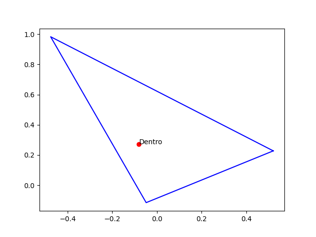

# Functions with polygons
Santiago Lillo Macías
2026-04-16

# Tangent lines

The first part of this file consists in: given a polygon and a point Q outside of that polygon, to determine the tangent lines to the polygon from Q. The polygon is a `list` of `Punto` objects. 


The output is a `list` of two points, the polygon touching-vertices of the tangent (the "starting" one is Q). To avoid problems with the tangents, we suppose Q is on the semiplane {x < 0} and pol is on {x >= 0}. If the tangent touches a side of the polygon (i.e. two vertices), we choose the closest one.

We take Q as the "origin" (and not `(0,0)`). We calculate the angles of every polygon vertex from Q. Then we sort it and take the maximum and the minimum of that list (first and last).

```{python}
def puntos_tangencia_poligono(q: Punto, pol: list[Punto]) -> list:
    def angulo2(p: Punto) -> float:       
        return math.atan2(p.y-q.y,p.x-q.x)
    
    lista = sorted(pol, key = angulo2)
    return [lista[0],lista[-1]]
```

## Test function

```{python}
def generate_random_polygon(n):
    # 1. Create random points
    points = [Punto(random.uniform(0,1), random.uniform(0,1)) for _ in range(n)]
    
    # 2. The "Untangling" loop
    swapped = True
    while swapped:
        swapped = False
        for i in range(n):
            for j in range(i + 2, n):
                # Don't check adjacent edges (they share a vertex)
                if i == 0 and j == n - 1: continue
                
                # Define the four points of the two edges we are checking
                p1, p2 = points[i], points[(i + 1) % n]
                p3, p4 = points[j], points[(j + 1) % n]
                
                if segmentos_se_cortan([p1, p2], [p3, p4]):
                    # 3. Swap the order of points between i+1 and j to uncross
                    points[i+1:j+1] = points[i+1:j+1][::-1]
                    swapped = True
    return points

def comprueba_puntos_tangencia_poligono(q = None, pol = None, n_vertices = 12):
    # --- Plotting ---
    if pol is None:
        pol = generate_random_polygon(n_vertices)
    # Close the polygon for plotting
    plot_data_x = [p.x for p in pol]
    plot_data_x.append(pol[0].x)
    plot_data_y = [p.y for p in pol]
    plot_data_y.append(pol[0].y)
    
    plt.figure(figsize=(6,6))
    plt.fill(plot_data_x, plot_data_y, alpha = 0.2, color = 'blue')

    if q is None: q = Punto(random.uniform(-2,-1), random.uniform(-.5,1.5))
    plt.plot(q.x, q.y, 'bo')
    res_tan = puntos_tangencia_poligono(q, pol)
    plt.plot([res_tan[0].x, q.x, res_tan[1].x], [res_tan[0].y, q.y, res_tan[1].y], 'ro-')
    plt.show()
```

## Example

```{text}
pol = None
comprueba_puntos_tangencia_poligono(pol)
```


# Polygon

We now approach this problem: given an ordered list of points, is it a polygon? Clrearly the first photo is a polygon and the second not.


We have a list of the vertices, so we create a list with pairs of vertices, i.e., the sides of the polygon. Then we check is any of this sides intersect.

```{python}
def es_poligono(pol: list[Punto]) -> bool:
    segmentos = [0]*len(pol)
    for i in range(len(pol)-1):
        segmentos[i] = [pol[i],pol[i+1]]
    segmentos[len(pol)-1] = [pol[len(pol)-1],pol[0]]

    for segmento1 in segmentos:
        for segmento2 in segmentos:
            if segmentos_se_cortan_interior(segmento1, segmento2):
                return False 
    return True
```

But we had defined our intersection function to be `True` if they intersect only on a vertex, which is `True` for every polygon. Hence, we modify the function.

```{python}
def segmentos_se_cortan_interior(s: list[Punto], t: list[Punto]) -> bool:
    """
    Devuelve True si dos segmentoss e cortan en su interior, es decir, no en sus extremos. False e.c.c.
    """
    #print('len', len([s[0],s[1],t[0],t[1]]))
    #print('set', set([s[0],s[1],t[0],t[1]]))
    if len([s[0],s[1],t[0],t[1]]) != len(set([s[0],s[1],t[0],t[1]])):
        #Entonces hay elementos repetidos --> Algún vértice es el mismo
        return False
    else:
        #t[0] y t[1] están a lados distintos de s /\ s[0] y s[1] están a lados distintos de t
        return ( orient(s[0],s[1],t[0]) != orient(s[0],s[1],t[1]) ) and ( orient(t[0],t[1],s[0]) != orient(t[0],t[1],s[1]) )
```

## Test function

```{python}
def comprueba_es_poligono(pol = None):
    n_vertices = 10
    if pol is None:
        pol = generate_random_polygon(n_vertices)
    
    #if random.choice([True, False]):
    pol[0], pol[1] = pol[1], pol[0]
    
    plot_data_x = [p.x for p in pol]
    plot_data_x.append(pol[0].x)
    plot_data_y = [p.y for p in pol]
    plot_data_y.append(pol[0].y)
    
    plt.plot(plot_data_x, plot_data_y, 'bo-')
    respuesta = es_poligono(pol)
    texto = 'Sí' if respuesta else 'No'
    texto = texto + ' es polígono'
    plt.title(texto)
    plt.show()
```

```{text}
pol = None
comprueba_es_poligono(pol)
```



```{text}
pol = None
comprueba_es_poligono(pol)
```

